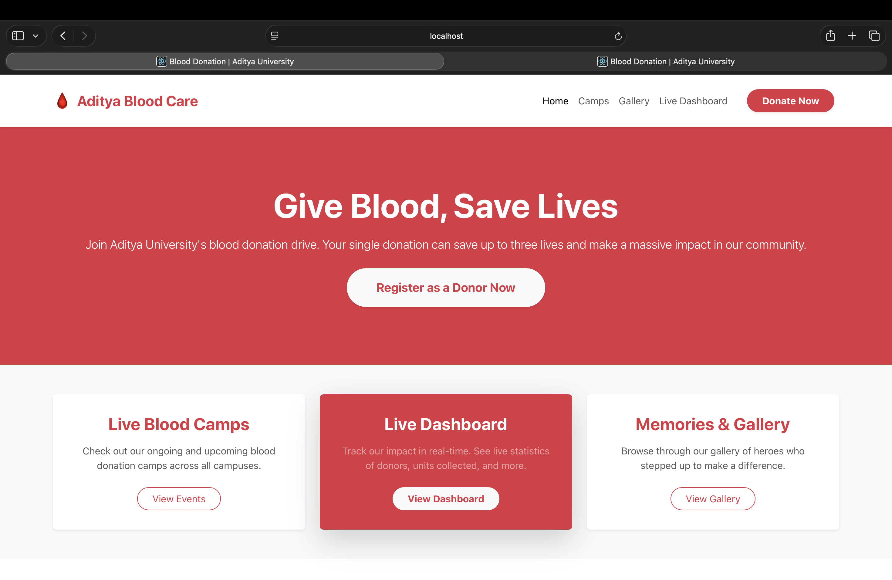
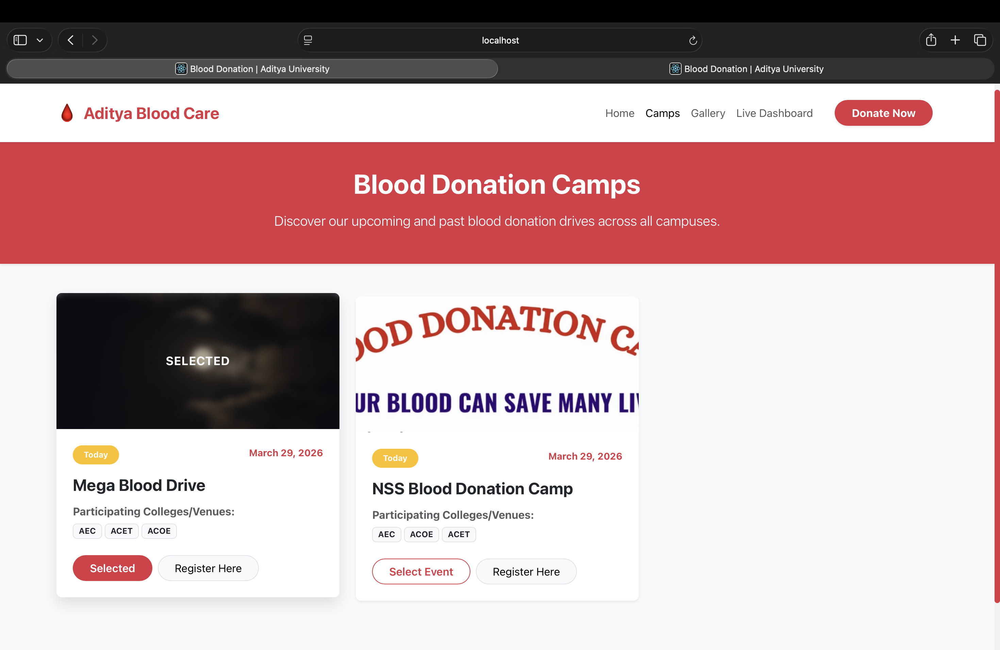
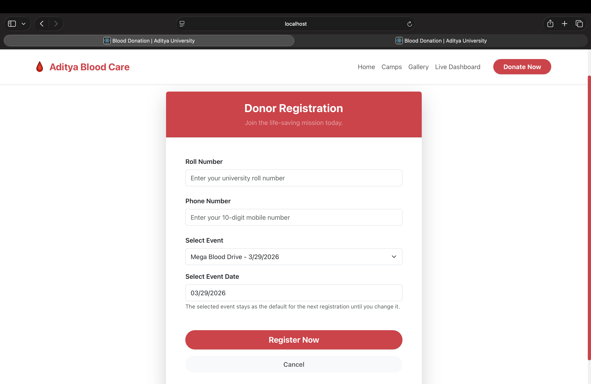
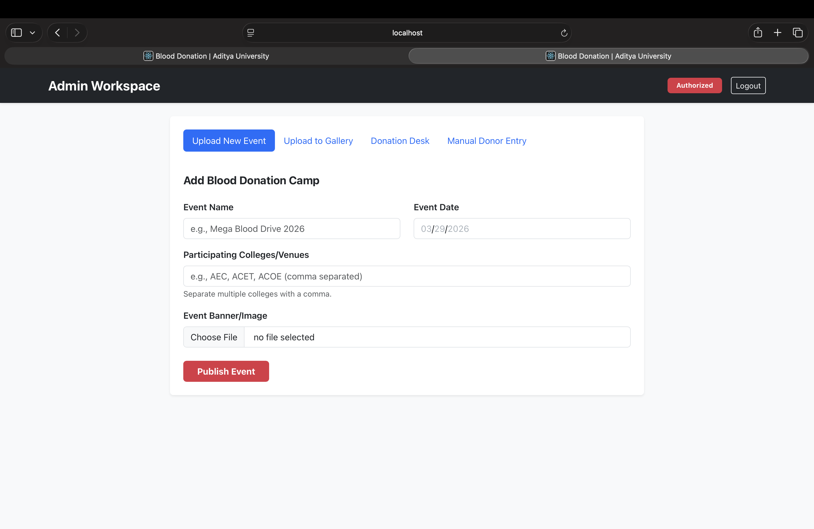
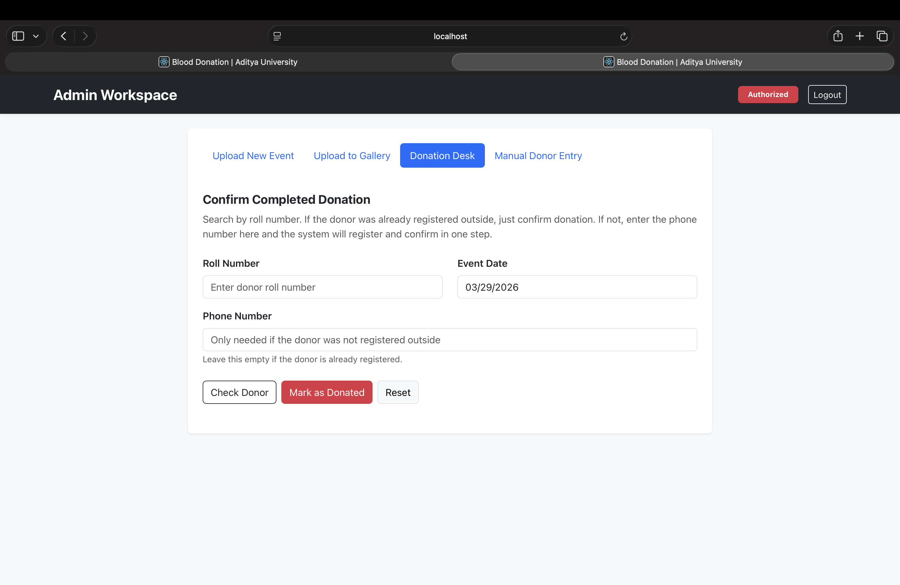
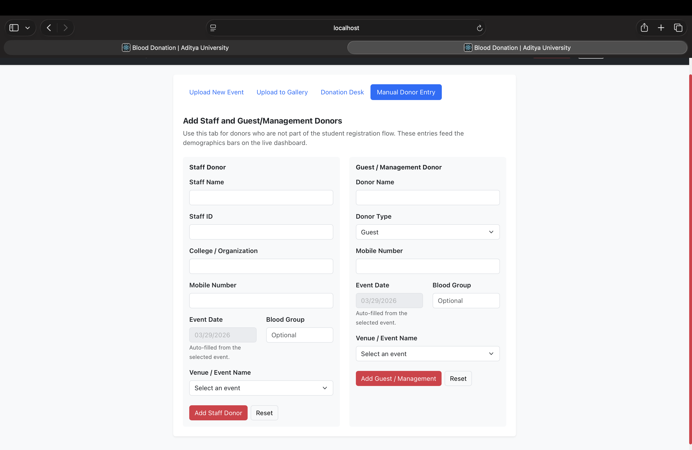
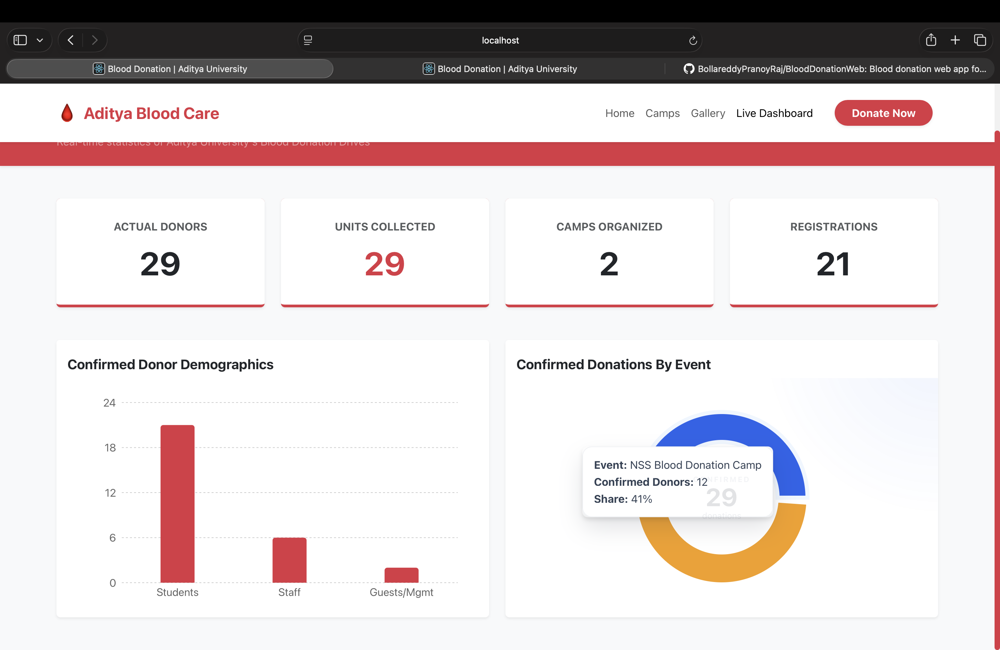

# Blood Donation Web

Full-stack blood donation management platform built for Aditya University. The application supports camp-based donor registration, admin-side camp management, donation confirmation, manual donor entry for staff and guest/management donors, gallery management, and a live dashboard for tracking donation activity.

## Highlights

- Camp-based donor registration flow
- Admin workspace for camp and gallery management
- Donation desk flow for confirming completed donations
- Manual donor entry for non-student donors
- Live dashboard with donor demographics and event-wise analytics
- Real-time dashboard refresh using Socket.IO

## Tech Stack

| Layer | Technologies |
| --- | --- |
| Frontend | React, React Router, React Bootstrap, Axios, Recharts, Socket.IO Client |
| Backend | Node.js, Express, Mongoose, Multer, Socket.IO |
| Database | MongoDB |

## Features

### Public User Features

- Browse available blood donation camps
- Select a camp before registration
- Register as a donor with roll number, phone number, and camp date
- View gallery images from blood donation camps

### Admin Features

- Admin login
- Create blood donation camps with banner/image upload
- Upload images to the gallery
- Confirm student donations through the donation desk
- Add staff donors manually
- Add guest/management donors manually

### Dashboard Features

- Actual donor count
- Units collected
- Number of camps organized
- Total registrations
- Confirmed donor demographics
- Confirmed donations by camp

## Screenshots

### Home Page



### Camps Page



### Registration Page



### Admin Dashboard



### Donation Desk



### Manual Donor Entry



### Live Dashboard



## Project Structure

```text
BloodDonationWeb/
├── bd_backend/     # Express backend and MongoDB integration
└── bd_frontend/    # React frontend
```

## Local Setup

### 1. Clone the repository

```bash
git clone https://github.com/BollareddyPranoyRaj/BloodDonationWeb.git
cd BloodDonationWeb
```

### 2. Install dependencies

Backend:

```bash
cd bd_backend
npm install
```

Frontend:

```bash
cd ../bd_frontend
npm install
```

### 3. Configure environment

Create a `.env` file inside `bd_backend/`:

```env
MONGODB_URI=mongodb://127.0.0.1:27017/blood_donation_db
```

You can replace the value above with any local or remote MongoDB connection string.

### 4. Start the backend

```bash
cd bd_backend
npm run dev
```

Backend URL:

```text
http://localhost:5001
```

### 5. Start the frontend

Open a new terminal:

```bash
cd bd_frontend
npm start
```

Frontend URL:

```text
http://localhost:3000
```

## Available Scripts

### Frontend

```bash
npm start
npm run build
```

### Backend

```bash
npm start
npm run dev
```

## Core Flow

### Donor Registration

1. User opens the camps page
2. User selects a camp
3. User completes donor registration
4. Registration is stored in MongoDB

### Donation Confirmation

1. Admin opens the donation desk
2. Admin searches donor registration by roll number and event date
3. Admin confirms donation
4. Dashboard updates live

### Manual Donor Entry

1. Admin selects an existing camp
2. Admin adds staff or guest/management donor details
3. Dashboard updates demographics and camp totals

## API Overview

Some of the main backend routes include:

- `GET /api/events`
- `POST /api/create-event`
- `GET /api/registrations`
- `POST /api/register`
- `POST /api/registrations/confirm-donation`
- `POST /api/add-staff`
- `GET /api/staff`
- `POST /api/add-guest-management`
- `GET /api/guest-management`
- `POST /api/upload-gallery`
- `GET /api/gallery`

## Notes

- MongoDB must be running before starting the backend unless you use a hosted database connection
- Event and gallery images are handled by the backend
- The frontend production build is generated in `bd_frontend/build`
- This project is intended as a full-stack academic/project portfolio application

## Future Improvements

- Add deployment instructions
- Add screenshots or a short demo GIF
- Add donor export/reporting
- Improve validation and error messages
- Add automated tests

## Author

Bollareddy Pranoy Raj
